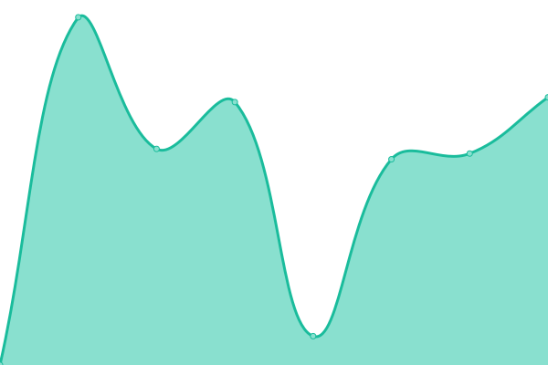

# [📈 Live Status](https://ssammons-np.github.io/gtg-uptime): <!--live status--> **🟧 Partial outage**

This repository contains the open-source uptime monitor and status page for [ssammons-np](https://ssammons-np.github.io/gtg-uptime), powered by [Upptime](https://github.com/upptime/upptime).

With [Upptime](https://upptime.js.org), you can get your own unlimited and free uptime monitor and status page, powered entirely by a GitHub repository. We use [Issues](https://github.com/ssammons-np/gtg-uptime/issues) as incident reports, [Actions](https://github.com/ssammons-np/gtg-uptime/actions) as uptime monitors, and [Pages](https://ssammons-np.github.io/gtg-uptime) for the status page.

<!--start: status pages-->
<!-- This summary is generated by Upptime (https://github.com/upptime/upptime) -->
<!-- Do not edit this manually, your changes will be overwritten -->
<!-- prettier-ignore -->
| URL | Status | History | Response Time | Uptime |
| --- | ------ | ------- | ------------- | ------ |
|  [IXL](https://www.ixl.com/signin/gatewaygroup) | 🟩 Up | [ixl.yml](https://github.com/ssammons-np/gtg-uptime/commits/HEAD/history/ixl.yml) | 

 419ms
     
 | 

<a href="https://ssammons-np.github.io/gtg-uptime/history/ixl">100.00%</a>
    

|  [Library](http://library.npelem.com) | 🟥 Down | [library.yml](https://github.com/ssammons-np/gtg-uptime/commits/HEAD/history/library.yml) | 

 595ms
     
 | 

<a href="https://ssammons-np.github.io/gtg-uptime/history/library">99.26%</a>
    

|  [WHES Library](http://whes.npelem.com) | 🟩 Up | [whes-library.yml](https://github.com/ssammons-np/gtg-uptime/commits/HEAD/history/whes-library.yml) | 

 411ms
     
 | 

<a href="https://ssammons-np.github.io/gtg-uptime/history/whes-library">99.27%</a>
    

|  [NP Website](https://www.npelem.com) | 🟩 Up | [np-website.yml](https://github.com/ssammons-np/gtg-uptime/commits/HEAD/history/np-website.yml) | 

 1380ms
     
 | 

<a href="https://ssammons-np.github.io/gtg-uptime/history/np-website">100.00%</a>
    

|  [WV Website](https://www.westvillesd.com) | 🟩 Up | [wv-website.yml](https://github.com/ssammons-np/gtg-uptime/commits/HEAD/history/wv-website.yml) | 

 219ms
     
 | 

<a href="https://ssammons-np.github.io/gtg-uptime/history/wv-website">100.00%</a>
    

|  [WN Website](https://www.wenonahsd.org) | 🟩 Up | [wn-website.yml](https://github.com/ssammons-np/gtg-uptime/commits/HEAD/history/wn-website.yml) | 

 311ms
     
 | 

<a href="https://ssammons-np.github.io/gtg-uptime/history/wn-website">100.00%</a>
    

|  [GW Website](https://www.gatewayhs.com) | 🟩 Up | [gw-website.yml](https://github.com/ssammons-np/gtg-uptime/commits/HEAD/history/gw-website.yml) | 

 1107ms
     
 | 

<a href="https://ssammons-np.github.io/gtg-uptime/history/gw-website">99.82%</a>
    

<!--end: status pages-->

[**Visit our status website →**](https://ssammons-np.github.io/gtg-uptime)

## 📄 License

- Powered by: [Upptime](https://github.com/upptime/upptime)
- Code: [MIT](./LICENSE) © [Anand Chowdhary](https://anandchowdhary.com), supported by [Pabio](https://pabio.com)
- Data in the `./history` directory: [Open Database License](https://opendatacommons.org/licenses/odbl/1-0/)
